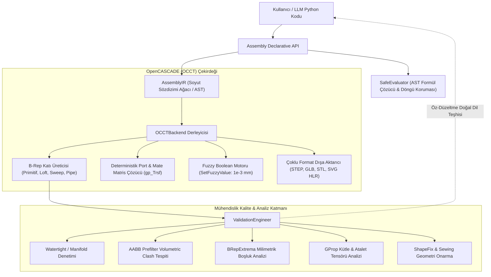

# CADi SAML (Spatial Assembly Modeling Language) Kapsamlı Başvuru & Mimari Kılavuzu

Bu doküman, `cadi_saml` Python CAD kütüphanesinin tüm mimarisini, veri yapılarını, API metodlarını, standart parça modüllerini, port eşleme kurallarını ve OpenCASCADE (OCCT) analiz yeteneklerini eksiksiz olarak belgeler.

---

## 📑 İçindekiler
1. [Hızlı Başlangıç (Quick Start)](#1-hızlı-başlangıç-quick-start)
2. [Koordinat Sistemi ve Birim Konvansiyonu](#2-koordinat-sistemi-ve-birim-konvansiyonu)
3. [Mimari Genel Bakış & Akış Şeması](#3-mimari-genel-bakış--akış-şeması)
4. [Ana Sınıf: `Assembly` API Referansı](#4-ana-sınıf-assembly-api-referansı)
5. [Parça Referansı: `PartReference` API Referansı](#5-parça-referansı-partreference-api-referansı)
6. [Otomatik Port Referansları Kapsamlı Tablosu](#6-otomatik-port-referansları-kapsamlı-tablosu)
7. [Montaj İlişkileri Kılavuzu: `connect()`, `align_holes()`, `attach()`](#7-montaj-ilişkileri-kılavuzu)
8. [Geometrik Primitifler ve Katı Oluşturucular](#8-geometrik-primitifler-ve-katı-oluşturucular)
9. [Organik ve İleri B-Rep Modelleme (Extrude, Loft, Sweep, Pipe, Revolve)](#9-organik-ve-ileri-b-rep-modelleme)
10. [Standart Mühendislik Parça Kütüphanesi (`std_parts`)](#10-standart-mühendislik-parça-kütüphanesi-std_parts)
11. [Üst Seviye Mühendislik Makroları](#11-üst-seviye-mühendislik-makroları)
12. [Malzeme Veritabanı ve Fiziksel Özellikler](#12-malzeme-veritabanı-ve-fiziksel-özellikler)
13. [OpenCASCADE Doğrulama ve Analiz Motoru (`ValidationEngineer`)](#13-opencascade-doğrulama-ve-analiz-motoru)
14. [SafeEvaluator Formül Grameri ve Güvenlik](#14-safeevaluator-formül-grameri-ve-güvenlik)
15. [Hata ve İstisna Sınıfları](#15-hata-ve-istisna-sınıfları)
16. [Uçtan Uca Tam Kısıtlanmış Kod Örnekleri](#16-uçtan-uca-tam-kısıtlanmış-kod-örnekleri)
17. [Alfabetik Metod İndeksi](#17-alfabetik-metod-indeksi)
18. [Yapay Zeka Fine-Tuning & Veri Sözleşmesi (Data Contract & Standards Catalog)](#18-yapay-zeka-fine-tuning--veri-sözleşmesi)

---

## 1. Hızlı Başlangıç (Quick Start)

5 satırda parametrik parça oluşturma, renklendirme ve AP214 renkli STEP olarak dışa aktarma:

```python
from cadi_saml import Assembly

asm = Assembly("QuickStart_Model")
box = asm.add_box("chassis_block", length=100.0, width=60.0, height=30.0)
box.set_appearance(color=(0.15, 0.45, 0.85), material="Aluminum6061")
box.add_fillet(radius=4.0, edges="all_top").add_hole("center_bore", diameter=20.0)
asm.export_step("output/quickstart.step")
```

---

## 2. Koordinat Sistemi ve Birim Konvansiyonu

`cadi_saml`, ISO ve endüstri standardı CAD konvansiyonlarını sıkı şekilde uygular:

- **Koordinat Sistemi**: **Sağ El Kuralı (Right-Hand Rule)** kartezyen koordinat sistemi.
- **Dikey Eksen (Up Vector)**: Varsayılan olarak **$+Z$** yönü yukarıdır (Gravity: $-Z$).
  - $XY$ Düzlemi: Zemin / Montaj Tabanı (Normal: $+Z$)
  - $XZ$ Düzlemi: Ön Görünüş (Front View, Normal: $+Y$)
  - $YZ$ Düzlemi: Yan Görünüş (Side View, Normal: $+X$)
- **Açı Ölçü Birimi**: Tüm açı parametreleri (`angle`, `helix_angle`, `draft_angle`, `start_angle`) standart olarak **Derece (°)** cinsindendir. Çekirdek içinde `math.radians()` ile otomatik radyana dönüştürülür.
- **Uzunluk ve Geometri Birimi**: Standart birim **Milimetre ($mm$)**'dir.
- **Kütle Birimi**: Hacimler $mm^3$, kütleler Kilogram ($kg$), yoğunluklar $g/cm^3$ veya $kg/m^3$ cinsindendir.

---

## 3. Mimari Genel Bakış & Akış Şeması



---

## 4. Ana Sınıf: `Assembly` API Referansı

| Metod | Parametreler | Çıktı / Dönüş | Açıklama |
| :--- | :--- | :--- | :--- |
| `Assembly(name, ...)` | `name, units="mm", tolerance_standard="ISO 2768-m", material=None, export=None` | `Assembly` | Montaj konteynerini başlatır. |
| `set_var(name, value)` | `name: str, value: Any (float/str)` | `self` | Parametrik master değişken veya formül tanımlar. |
| `get_var(name)` | `name: str` | `float` | Değişkenin sayısal karşılığını formülü çözerek döner. |
| `connect(...)` | `first_target, second_target, mate_type="FLUSH", offset=0.0, angle=0.0` | `None` | İki parçayı semantik portlar üzerinden uzayda kilitler. |
| `align_holes(h1, h2)` | `hole1: str, hole2: str` | `None` | İki silindirik deliği eş eksenli olarak hizalar. |
| `attach(p1, p2)` | `first_port: str, second_port: str` | `None` | İki parçayı 6 serbestlik derecesini sıfırlayarak kilitler. |
| `cut(target, tool)` | `target_part: str, tool_part: str, keep_tool: bool = False` | `None` | Boşaltma / Çıkarma boolean operasyonu (`BooleanOpType.CUT`). |
| `fuse(target, tool)` | `target_part: str, tool_part: str, keep_tool: bool = False` | `None` | Gövde birleştirme / Kaynatma (`BooleanOpType.FUSE`). |
| `intersect(target, tool)` | `target_part: str, tool_part: str, keep_tool: bool = False` | `None` | Kesişim hacmini alma (`BooleanOpType.INTERSECT`). |
| `pattern_circular(...)` | `target_part, count, center=(0,0,0), axis=(0,0,1), angle=360.0` | `None` | Parçayı dairesel dizi olarak çoğaltır. |
| `pattern_linear(...)` | `target_part, count, spacing=(dx, dy, dz)` | `None` | Parçayı doğrusal eksen boyunca çoğaltır. |
| `import_step(name, path)` | `name: str, step_file_path: str` | `PartReference` | Harici STEP modelini montaja parça olarak ekler. |
| `export_step(path)` | `output_path: str` | `str` | Montajı AP214 renkli STEP olarak kaydeder. |
| `export_glb(path)` | `output_path: str, deflection: float = 0.08` | `str` | Web ve 3D görüntüleyiciler için glTF/GLB kaydeder. |
| `export_stl(path)` | `output_path: str, deflection: float = 0.1` | `str` | 3B baskı ve FEA simülasyonu için STL oluşturur. |
| `export_technical_drawing(path)`| `output_svg_path, views=None, sheet_width=1920, sheet_height=1080` | `str` | 4-görünüşlü HLR gizli çizgili 2B vektör SVG üretir. |
| `get_cross_section_edges(...)`| `origin=(0,0,0), normal=(0,0,1)` | `List[Edge]` | Montajı düzlemle keserek 2B kesit profillerini döner. |
| `check_clearances(...)` | `min_clearance_mm: float = 2.0` | `List[ClearanceReport]` | Parçalar arası milimetrik minimum boşlukları denetler. |
| `get_mass_properties(...)` | `densities: Optional[Dict[str, float]] = None` | `Dict[str, Any]` | Toplam kütle, CoG ve parça kütle kırılımlarını hesaplar. |
| `get_constraint_status()` | `None` | `Dict[str, Any]` | Montaj serbestlik derecesi (DOF) ve kısıt durumunu raporlar. |
| `diagnose()` | `None` | `Dict[str, Any]` | LLM öz-tamir geri besleme raporunu derler. |
| `verify_contract(...)` | `test_step_roundtrip=True, check_clash=True` | `ContractReport` | 6 aşamalı üretim sözleşmesi doğrulama zincirini çalıştırır. |
| `add_internal_gear(...)` | `name, module=2.0, teeth=48, face_width=20.0, ...` | `PartReference` | Analitik evolvent iç dişli çemberi ve flanş delikleri ekler. |
| `add_planetary_relation(...)`| `sun_part, carrier_part, ring_part, planet_parts` | `PlanetaryRelation`| Willis kinematik bağıntısına göre episiklik planet mekanizmasını çözer. |
| `patch(diff)` | `diff: Dict[str, Any]` | `self` | Tek satırda delta parametre güncellemesi uygular. |

---

## 5. Parça Referansı: `PartReference` API Referansı

`Assembly.add_*` metodlarının döndürdüğü nesnedir. Metod zincirleme (fluent interface) destekler.

| Metod | Parametreler | Açıklama |
| :--- | :--- | :--- |
| `port(name)` | `port_name: str` | `"part_name:port:port_name"` seçicisi döner. Port geçersizse `StalePortError` fırlatır. |
| `face(alias)` | `face_alias: str ("top", "bottom", ">Z", "<Z")` | Yüzey seçici string'i döner. |
| `hole(alias)` | `hole_alias: str` | Delik seçici string'i döner. |
| `add_port(...)` | `name, port_type="face", position=(0,0,0), normal=(0,0,1), diameter=None` | Parçaya özel yeni bir semantik port ekler. |
| `add_hole(...)` | `name, diameter, depth=0.0, position=(x,y), face="top"` | Parçaya silindirik delik deler ve portunu oluşturur. |
| `add_pcd_holes(...)` | `count, diameter, pcd, start_angle=0.0, center=(0,0), depth=0.0` | Dairesel cıvata çemberi (PCD) delikleri deler. |
| `add_fillet(radius, edges)` | `radius: float, edges: str = "all_top"` | Kenarları yuvarlatır. |
| `add_chamfer(distance, edges)`| `distance: float, edges: str = "all_top"` | Kenarlara pah kırar. |
| `shell(thickness, open_face)` | `thickness: float = 2.0, open_face: str = "bottom"` | Parçanın içini boşaltarak et kalınlığı verir. |
| `add_draft_angle(...)` | `angle_deg=2.0, pull_direction=(0,0,1), neutral_plane_z=0.0` | Döküm/kalıplama için yan yüzeylere açı verir. |
| `set_appearance(...)` | `color: Tuple[float, float, float], material: Optional[str] = None` | RGB renk ve mühendislik malzemesi atar. |

### Kenar Seçici Mini-Dili (`edges` parametresi)
- `"all"`: Parçadaki tüm kenarları seçer.
- `"all_top"`: Parçanın en üst $Z$ seviyesinde yer alan tüm kenarları seçer.
- `"all_bottom"`: Parçanın en alt $Z$ seviyesinde yer alan tüm kenarları seçer.

---

## 6. Otomatik Port Referansları Kapsamlı Tablosu

> [!IMPORTANT]
> "Sıfır koordinat" felsefesi gereği, her parçanın otomatik ürettiği port isimleri aşağıda listelenmiştir. Port seçimi yapılırken bu isimler doğrudan `part.port("isim")` şeklinde kullanılır:

| Bileşen Türü | Metod | Otomatik Üretilen Port İsimleri | Port Tipi | Konum & Doğrultu Detayı |
| :--- | :--- | :--- | :--- | :--- |
| **Cıvata** | `add_bolt` / `Fastener.ISO4762` | `head_base`<br>`head_top`<br>`shank`<br>`tip` | `FLANGE`<br>`FLANGE`<br>`AXIS`<br>`POINT` | Cıvata başı oturma yüzeyi ($Z=0$, normal $-Z$)<br>Cıvata başı üstü ($Z=k$, normal $+Z$)<br>Gövde silindir ekseni (boy $L$, $-Z$ yönü)<br>Gövde ucu en alt nokta ($Z=-L$) |
| **Somun** | `add_nut` / `Nut.DIN934` | `bottom_face`<br>`top_face`<br>`bore` | `FLANGE`<br>`FLANGE`<br>`HOLE` | Alt oturma yüzeyi ($Z=0$, normal $-Z$)<br>Üst oturma yüzeyi ($Z=m$, normal $+Z$)<br>İç diş ekseni ($Z=m/2$, $+Z$ ekseni) |
| **Pul** | `add_washer` / `Washer.DIN125` | `bottom_face`<br>`top_face`<br>`bore` | `FLANGE`<br>`FLANGE`<br>`HOLE` | Alt temas yüzeyi ($Z=0$, normal $-Z$)<br>Üst temas yüzeyi ($Z=s$, normal $+Z$)<br>İç delik merkezi ($Z=s/2$, $+Z$ ekseni) |
| **Rulman** | `add_bearing` / `Bearing.SKF` | `inner_bore`<br>`outer_cyl`<br>`front_face`<br>`back_face` | `HOLE`<br>`AXIS`<br>`FLANGE`<br>`FLANGE` | İç bilezik mil yuvası ($R_{inner}$, $+Z$ ekseni)<br>Dış bilezik montaj çapı ($R_{outer}$)<br>Ön yanal alın yüzeyi ($Z=W$, normal $+Z$)<br>Arka yanal alın yüzeyi ($Z=0$, normal $-Z$) |
| **Step Motor** | `add_motor` / `Motor.NEMA` | `shaft`<br>`flange`<br>`mount_1`..`mount_4`<br>`rear_face` | `SHAFT`<br>`FLANGE`<br>`HOLE`<br>`FLANGE` | Çıkış tahrik mili ($Z>0$, $+Z$ ekseni)<br>Ön montaj flanş yüzeyi ($Z=0$, $+Z$ normal)<br>4 adet dişli montaj delikleri<br>Motor arka kapağı ($Z=-L$, $-Z$ normal) |
| **V-Slot Profil**| `add_profile` / `Profile.VSlot`| `start_face`<br>`end_face`<br>`center_bore` | `FLANGE`<br>`FLANGE`<br>`HOLE` | Başlangıç kesiti ($Z=0$, normal $-Z$)<br>Bitiş kesiti ($Z=L$, normal $+Z$)<br>Merkez M4/M5 kılavuz deliği ekseni |
| **Flanş** | `add_flange` | `front_face`<br>`back_face`<br>`center_bore`<br>`pcd_hole_1`..`pcd_hole_N` | `FLANGE`<br>`FLANGE`<br>`HOLE`<br>`HOLE` | Ön alın yüzeyi ($Z=t$, normal $+Z$)<br>Arka oturma yüzeyi ($Z=0$, normal $-Z$)<br>Merkez delik ekseni (varsa)<br>Dairesel dizi montaj delikleri |
| **Kademeli Şaft**| `add_stepped_shaft` | `step_0`, `step_1`..`step_N`<br>`front_face`<br>`back_face`<br>`axis` | `SHAFT`<br>`FLANGE`<br>`FLANGE`<br>`AXIS` | **0-indeksli** her basamağın başlangıç oturma omzu<br>Şaftın en ön ucu ($Z=L_{toplam}$, $+Z$ normal)<br>Şaftın en arka ucu ($Z=0$, $-Z$ normal)<br>Şaft dönme ekseni ($+Z$ ekseni) |
| **Fren Diski** | `add_brake_rotor` | `mount_face`<br>`hub_mount_face`<br>`front_face`<br>`center_bore` | `FLANGE`<br>`FLANGE`<br>`FLANGE`<br>`HOLE` | Göbeğe oturan arka flanş yüzeyi ($Z=0$, $-Z$ normal)<br>`mount_face` eşdeğeri alias<br>Dış disk yüzeyi ($Z=t$, $+Z$ normal)<br>Merkez göbek deliği ($+Z$ ekseni) |
| **Fren Kaliperi**| `add_brake_caliper` | `mount_1`, `mount_2`<br>`slot_center` | `HOLE`<br>`POINT` | Kaliper taşıyıcı bağlantı delikleri ($Y$ yönü eksen)<br>Fren diskinin geçtiği boşluk merkezi |
| **Mafsal (Heim)**| `add_heim_joint` | `ball_bore`<br>`ball_face_front`<br>`ball_face_back`<br>`shank_thread` | `HOLE`<br>`FLANGE`<br>`FLANGE`<br>`SHAFT` | Küresel mafsal cıvata deliği ($Z$ ekseni)<br>Küre sağ yanak oturma yüzeyi<br>Küre sol yanak oturma yüzeyi<br>Salıncağa vidalanan dişli saplama ekseni |
| **Düz Dişli** | `add_spur_gear` | `bore_axis`<br>`front_face`<br>`back_face`<br>`pitch_point` | `AXIS`<br>`FLANGE`<br>`FLANGE`<br>`POINT` | Mil deliği ve dönme ekseni ($+Z$ ekseni)<br>Ön diş yanağı ($Z=b$, $+Z$ normal)<br>Arka diş yanağı ($Z=0$, $-Z$ normal)<br>Yuvarlanma dairesi ($d=m \cdot z$) teğet noktası |
| **Helisel Dişli**| `add_helical_gear` | `bore_axis`<br>`front_face`<br>`back_face` | `AXIS`<br>`FLANGE`<br>`FLANGE` | Mil deliği ekseni ($+Z$ ekseni)<br>Ön yüzey ($Z=b$, $+Z$ normal)<br>Arka yüzey ($Z=0$, $-Z$ normal) |
| **Kremayer Dişli**| `add_rack` | `pitch_line` | `AXIS` | Kremayer yuvarlanma doğrusu ($X$ ekseni yönünde) |
| **Helisel Yay** | `add_coil_spring` | `bottom_seat`<br>`top_seat`<br>`spring_axis` | `FLANGE`<br>`FLANGE`<br>`AXIS` | Alt taşlanmış düz oturma yüzeyi ($Z=0$, normal $-Z$)<br>Üst taşlanmış düz oturma yüzeyi ($Z=L_0$, normal $+Z$)<br>Yay merkez ekseni ($+Z$ ekseni) |
| **Coilover** | `add_coilover` | `bottom_eyelet`<br>`top_eyelet`<br>`damper_axis` | `HOLE`<br>`HOLE`<br>`AXIS` | Alt salıncak montaj deliği ($Z=0$, eksen $Y$)<br>Üst şasi kule montaj deliği ($Z=L_{ext}$, eksen $Y$)<br>Amortisör çalışma ekseni ($+Z$ ekseni) |
| **Boru / Tesisat**| `add_pipe` | `inlet`<br>`outlet` | `HOLE`<br>`HOLE` | Boru başlangıç kesit deliği (1. nokta)<br>Boru bitiş kesit deli (son nokta) |

---

## 7. Montaj İlişkileri Kılavuzu

`cadi_saml`, parçaların birbirine bağlanmasında 3 temel metod sunar:

### A. `connect(first_target, second_target, mate_type="FLUSH", offset=0.0, angle=0.0)`
Genel amaçlı kısıtlama yöneticisidir.
- `mate_type="FLUSH"`: İki düzlemsel yüzeyin normallerini **aynı yöne** baktırarak çakıştırır.
- `mate_type="COINCIDENT"`: İki düzlemsel yüzeyin normallerini **karşı karşıya (zıt yöne)** getirerek temas ettirir.
- `mate_type="COAXIAL"` veya `"CONCENTRIC"`: İki silindirik ekseni (mil ve delik gibi) tam eş merkezli hizalar.
- `mate_type="DISTANCE"`: İki yüzey arasına `offset` ($mm$) mesafesi koyarak paralel kilitler.

### B. `align_holes(hole_a, hole_b)`
İki silindirik deliği eş merkezli ve aynı doğrultuda hizalar. Parçanın delik ekseni etrafında dönme serbestliğini korur (örneğin menteşe veya tek cıvatalı mafsal bağlantıları).

### C. `attach(port_a, port_b)`
İki portu tüm 6 serbestlik derecesini (3 öteleme, 3 dönme) sıfırlayarak tek bir rijit gövde gibi birbirine kaynaklar/kilitler.

---

## 8. Geometrik Primitifler ve Katı Oluşturucular

| Metod | Parametreler | Çıktı | Açıklama |
| :--- | :--- | :--- | :--- |
| `add_box(...)` | `name, length, width, height, origin=(0,0,0)` | `PartReference` | Merkezlenmiş dikdörtgen prizma oluşturur. |
| `add_cylinder(...)` | `name, radius, height, origin=(0,0,0), direction=(0,0,1)` | `PartReference` | Silindirik gövde oluşturur. |
| `add_cone(...)` | `name, bottom_radius, top_radius, height, origin=(0,0,0)` | `PartReference` | Taban ve tepe yarıçapı farklı konik gövde. |
| `add_sphere(...)` | `name, radius, origin=(0,0,0)` | `PartReference` | Küresel katı gövde. |
| `add_torus(...)` | `name, major_radius, minor_radius, origin=(0,0,0)` | `PartReference` | Torus (halka/simit) gövde. |

---

## 9. Organik ve İleri B-Rep Modelleme

### 1. Düz Ekstrüzyon (`add_extrude`)
2B düzlemsel bir kesiti veya `Sketch` nesnesini doğrusal bir vektör boyunca katılaştırır:
```python
sec = asm.section_rectangle(width=40.0, height=20.0)
beam = asm.add_extrude("bracket_arm", section=sec, distance=150.0, direction=(0.0, 0.0, 1.0))
```

### 2. B-Rep Loft (`add_loft`)
Farklı geometrideki birden fazla 2B kesitin arasını pürüzsüz C2 yüzeyle örerek katılaştırır:
```python
s1 = asm.section_circle(radius=30.0, center=(0, 0, 0))
s2 = asm.section_rectangle(width=40.0, height=40.0, center=(0, 0, 80.0))
transition = asm.add_loft("diffuser", sections=[s1, s2], ruled=False)
```

### 3. 3B Borulama ve Tesisat (`add_pipe`)
3B uzay koordinatları boyunca yumuşak C2 B-Spline eğrisi üzerinden et kalınlığına sahip içi boş boru üretir:
```python
pipe = asm.add_pipe("oil_line", points=[(0, 0, 0), (50, 0, 0), (50, 60, 20)], outer_dia=10.0, wall_thickness=1.5)
```

> **Çift Nokta Giriş Formatı**: `add_pipe`, `section_polygon` ve `section_spline` metodları hem standart Python liste formatını `[(0,0,0), (10,20,5)]` hem de LLM token tasarrufu sağlayan kompakt string formatını `"0,0,0 10,20,5"` doğrudan kabul eder.

---

## 10. Standart Mühendislik Parça Kütüphanesi (`std_parts`)

Standart parçalar, elle çizim gerektirmeden tek satırda çağrılır:

```python
# Cıvata, Somun, Pul
bolt = asm.add_bolt("m8_bolt", size="M8", length=35.0)
nut = asm.add_nut("lock_nut", standard="DIN985", size="M8")
washer = asm.add_washer("flat_washer", standard="DIN125", size="M8")

# Rulman ve Motor
bearing = asm.add_bearing("wheel_bearing", standard="SKF", code="608ZZ")
motor = asm.add_motor("drive_stepper", frame="NEMA23", body_length=56.0)

# Dişli ve Yay
pinion = asm.add_spur_gear("pinion", module=2.0, teeth=18, face_width=20.0, bore_dia=14.0)
spring = asm.add_coil_spring("valve_spring", wire_dia=4.0, outer_dia=35.0, free_length=70.0, ground_ends=True)
```

---

## 11. Üst Seviye Mühendislik Makroları

1. **Flanş (`add_flange`)**:
   ```python
   flange = asm.add_flange("hub", outer_diameter=120.0, thickness=12.0, inner_bore=30.0, bolt_pcd=85.0, bolt_count=5)
   ```
2. **Kademeli Şanzıman Mili (`add_stepped_shaft`)**:
   ```python
   # 0-indeksli basamaklar (step_0, step_1, ... portları)
   shaft = asm.add_stepped_shaft("input_shaft", steps=[(20, 30), (35, 15), (50, 40)])
   ```
3. **Çelik I-Kiriş (`add_ibeam`)**:
   ```python
   beam = asm.add_ibeam("crossmember", length=500.0, height=80.0, flange_width=46.0)
   ```
4. **Episiklik Planet Dişli Kademesi (`add_planetary_stage` & `add_internal_gear`)**:
   Willis denklemini ($\frac{\omega_s - \omega_c}{\omega_r - \omega_c} = -\frac{z_r}{z_s}$) sağlayan tam analitik iç involüt ring gear, sun gear, carrier ve planet pinyonlarını oluşturur:
   ```python
   stage = asm.add_planetary_stage("stage1", module=2.5, ratio=4.0, carrier_thickness=12.0)
   # solve_planetary_teeth(ratio=4.0, module=2.5, planet_count=3) ile otomatik diş çözümü
   ```
5. **Mil İşleme Detayları (`add_shaft_keyway` & `add_circlip_groove`)**:
   DIN 6885 Form A/B kamaları ve DIN 471 segman kanallarını sıfır koordinatla açar:
   ```python
   # Parça altına doğrudan ortalar (z_position koordinat uydurma yok!)
   asm.add_shaft_keyway(target_shaft="main_shaft", under_part="driven_gear")
   asm.add_circlip_groove(target_shaft="main_shaft", against_part="bearing_front", side="right")
   ```
6. **Delik Sihirbazı (`add_threaded_hole`)**:
   ISO metrik vida standartlarına (M3 - M24) göre anma/diş dibi çapında dişli delik deler:
   ```python
   asm.add_threaded_hole(target_part="base_plate", thread="M8", depth=20.0, position=(40, 50))
   ```
7. **Semantik 3B Borulama (`add_pipe_route`)**:
   EN 10220 / DIN 2448 standart boru ölçülerinde iki port arasında 3B bükümlü tesisat rotası çeker:
   ```python
   asm.add_pipe_route("lube_line", from_port="pump:top", to_port="tank:left", standard="DN25")
   ```
8. **Kam Profili & Hareket Yasası (`add_disk_cam`)**:
   Sikloidal, basit harmonik veya modifiye sinüs yasalarına göre disk kam profili üretir:
   ```python
   asm.add_disk_cam("cam", base_radius=30.0, stroke=12.0, segments=[
       {"type": "rise", "angle_deg": 120.0, "law": "cycloidal"},
       {"type": "dwell", "angle_deg": 60.0},
       {"type": "fall", "angle_deg": 120.0, "law": "harmonic"},
       {"type": "dwell", "angle_deg": 60.0},
   ])
   ```

---

## 12. Malzeme Veritabanı ve Fiziksel Özellikler

OpenCASCADE `GProp` motorunda desteklenen standart malzeme yoğunlukları:

| Malzeme Tanımı (`material`) | Yoğunluk ($g/cm^3$) | Yoğunluk ($kg/m^3$) | Tipik Kullanım Alanı |
| :--- | :--- | :--- | :--- |
| `Steel` / `CarbonSteel` | `7.85` | `7850.0` | Cıvatalar, miller, dişliler |
| `StainlessSteel` / `Steel420` | `7.95` | `7950.0` | Fren diskleri, paslanmaz bağlantılar |
| `Aluminum` / `Aluminum6061` | `2.70` | `2700.0` | Jantlar, flanşlar, hafif braketler |
| `Aluminum7075` | `2.81` | `2810.0` | Havacılık ve yarış centerlock somunları |
| `Titanium` | `4.43` | `4430.0` | Yüksek mukavemetli yarış saplamaları |
| `Copper` / `Brass` | `8.96` | `8960.0` | Elektrik baraları, burçlar |
| `CarbonFiber` | `1.55` | `1550.0` | Kompozit aerodinamik kanatlar |
| `Rubber` | `1.20` | `1200.0` | Titreşim takozları, o-ringler |

### `get_mass_properties()` Dönüş Sözlüğü Yapısı
```python
props = asm.get_mass_properties()
# {
#   "total_volume_mm3": 1000000.0,
#   "total_mass_kg": 2.70,
#   "total_cg": (50.0, 50.0, 50.0),   # (X, Y, Z) mm
#   "parts": {
#       "part_name": {
#           "volume_mm3": 1000000.0,
#           "mass_kg": 2.70,
#           "center_of_gravity": (50.0, 50.0, 50.0),
#           "material": "Aluminum6061",
#           "density_g_cm3": 2.7
#       }
#   }
# }
```

---

## 13. OpenCASCADE Doğrulama, Tolerans ve Çarpışma Motoru

`ValidationEngineer` ve `OCCTBackend` sınıfları modelin imalata uygunluğunu ve montaj kararlılığını garanti eder:

1. **1D Sweep-and-Prune Çarpışma Denetimi (`check_clashes`)**:
   - **Geniş Faz (Broad-Phase)**: Parçaların AABB kutuları $X_{\min}$ koordinatına göre $O(N \log N)$ sürede sıralanır. $X$ ekseninde örtüşmeyen çiftler anında elenir ($O(N + K)$).
   - **Dar Faz (Narrow-Phase)**: Yalnızca örtüşen $K$ adet aday çift için tam OpenCASCADE `BRepAlgoAPI_Common` katı kesişimi çalıştırılır ($O(K)$, $K \ll N^2$).
2. **Ölçek-Bağımsız Adaptif Fuzzy Boolean**:
   - Sabit $10^{-3}$ mm yerine geometri köşegenine ($D$) göre dinamik hesaplanır:
     $$\epsilon_{\text{fuzzy}} = \max(10^{-4}, \min(0.05, D \times 10^{-5}))$$
   - Mikro vidalarda aşırı toleransı, 1000mm yapısal kirişlerde ise mikro kesim çökmelerini tamamen önler.
3. **`check_manifold(shape)`**: B-Rep katısının kapalı, su geçirmez (watertight manifold) olduğunu doğrular.
4. **`check_clearances(solids, min_clearance_mm=2.0)`**: `BRepExtrema_DistShapeShape` ile parçalar arasındaki minimum mesafeyi ve temas koordinatlarını hesaplar (`ClearanceReport`).
5. **`heal_shape(shape, tolerance=1e-3)`**: `ShapeFix_Shape` ve `BRepBuilderAPI_Sewing` ile bozuk STEP modellerini diker ve tamir eder.
6. **`get_cross_section_edges(origin, normal)`**: `BRepAlgoAPI_Section` ile katı montajı düzlemle keserek 2B profil eğrilerini üretir.

### 13.1 Post-Build Engineering Verification Contract (`verify_contract`)

Üretilen montajın fiziksel ve geometrik bütünlüğünü kanıtlayan 7 aşamalı doğrulama zinciri:
```python
contract_report = asm.verify_contract(
    test_step_roundtrip=True,
    check_clash=True,
    strict=True,
    expected_specs={
        "chassis": {"bounding_box": (100.0, 50.0, 20.0), "volume": 100000.0, "tolerance": 0.01}
    },
    require_provenance=True,
)
assert contract_report.passed is True
```

| Aşama | Denetlenen Kriter | Başarısızlık Şartı (`strict=True`) |
| :--- | :--- | :--- |
| **1. Compilation** | B-Rep IR $\rightarrow$ OpenCASCADE katı derlemesi | Sıfır katı üretilmesi veya OCCT derleme hatası. |
| **2. ManifoldIntegrity** | Kapalı kabuk, su geçirmezlik, yönelim doğruluğu (`BRepCheck`) | `BRepCheck_Analyzer.IsValid() == False` veya boş TopoDS şekil. |
| **3. DimensionAndVolume** | Pozitif kütle, dejenere olmayan 3B sınır kutusu (AABB) ve şartname uyumu | Hacim $\le 0$, AABB boyutu $\le 0.001$, `expected_specs` ile tolerans dışı sapma. |
| **4. InterferenceAndClearance**| İzin verilmeyen katı çakışmaları ve hacimsel girişimler | Çakışma hacmi $> 0.1\,mm^3$ veya çarpışma motorunda exception. |
| **5. KinematicConsistency** | Willis episiklik bağıntısı, kapalı kinematik çevrimler, serbestlik derecesi | Diş sayısı uyuşmazlığı ($z_r \neq z_s + 2z_p$), eksik joint veya çelişkili çevrimler. |
| **6. STEPRoundtrip** | AP214 STEP dışa aktarımı, tekrar açma ve geometri korunumu | Hacim farkı $> 0.5\%$, sınır kutusu farkı $> 0.5\%$, parça sayısı değişimi. |
| **7. ProvenanceCoverage** | Parametrelerin mühendislik kaynak izi | `require_provenance=True` iken kaydı olmayan parçaların bulunması. |

### 13.2 Parametre Provenance İzleme Sistemi (`ProvenanceRecord`)

LLM'in halüsinasyonla ölçü uydurmasını engelleyen ve her kritik geometrik parametrenin kaynağını belgeleyen sistem:
```python
# Fluent metod zincirleme ile provenance kaydı
part.track_provenance(
    parameter="outer_diameter",
    source="llm_json",             # "llm_json", "catalog", "calculated", "user"
    source_ref="spec.dimensions.od",# JSON path veya standart referansı (örn. DIN 6885)
    original_value=60.0,           # Ham girdi değeri
    effective_value=60.0,          # Modele uygulanan değer
    unit="mm",                     # Ölçü birimi
    transformation="exact",        # "exact", "rounding", "catalog_lookup", "calculated"
    confidence=0.99,               # 0.0 - 1.0 güven skoru
)
```

---

## 14. SafeEvaluator Formül Grameri & Statik DAG Analizi

LLM tarafından üretilen parametrik denklemler (`asm.set_var("b", "a * 2 + sqrt(c)")`), güvenlik açığı oluşturan `eval()` yerine AST (Soyut Sözdizimi Ağacı) analizörü `SafeEvaluator` ile çözülür:

- **İzin Verilen Fonksiyonlar**: `abs`, `min`, `max`, `round`, `int`, `float`, `sin`, `cos`, `tan`, `sqrt`, `pi`.
- **Statik Yönlü Graf (DAG) Çevrim Tespiti**: Çalışma anından önce tüm değişkenlerin bağımlılık grafiği inşa edilir (`build_dependency_dag`). $A \rightarrow B \rightarrow C \rightarrow A$ çevrimleri 3-renk DFS ile anında tespit edilerek `CircularDependencyError` fırlatılır.
- **Topolojik Sıralama (`topological_sort`)**: Değişkenlerin doğru hesaplama hiyerarşisi belirlenir.

---

## 15. Hata ve İstisna Sınıfları

| Hata Sınıfı | Fırlatılma Durumu | LLM Düzeltme Önerisi |
| :--- | :--- | :--- |
| `CADISpecificationError` | LLM eksik, tanımsız veya geometrik olarak imkansız parametre verdiğinde (asla sessiz varsayım veya uydurma geometri üretilmez). | `error.suggested_fix` ve `error.valid_options` alanlarındaki doğrulanmış seçeneklerden birini seçin. |
| `OverConstrainedError` | İki kısıt birbiriyle çeliştiğinde (örneğin delik eksen mesafesi uyuşmazlığı). | Delik mesafelerini veya kısıt ofsetlerini revize edin. |
| `StalePortError` | Pah, radius veya kesme sonucu referans yüzeyi yok olmuş bir porta bağlanıldığında. | Parçanın mevcut güncel portlarını (`asm.diagnose()`) kontrol edin. |
| `CircularDependencyError` | Parametrik değişkenlerde döngüsel formül tespiti ($A \rightarrow B \rightarrow A$). | Formül zincirini bağımsız parametreye bağlayın. |
| `ValueError` | Yanlış parça tipi, geçersiz tolerans veya tanımsız standart. | İlgili standardın geçerli adını girin (örn. 'M6', 'ISO4762'). |
| `KeyError` | Tanımlanmamış değişken veya parça adına erişim. | Parça veya değişken adının doğru tanımlandığını kontrol edin. |
| `RuntimeError` | OpenCASCADE geometrik çekirdeğinde dikiş/boolean başarısızlığı. | `val.heal_shape()` kullanın veya fuzzy boolean toleransını kontrol edin. |

---

## 16. Uçtan Uca Tam Kısıtlanmış Kod Örnekleri

### Örnek 1: Şanzıman Mili + Pinyon Dişli + Rulman Montajı
```python
from cadi_saml import Assembly

asm = Assembly("Gearbox_Subassembly")

# 1. Kademeli transmisyon mili (0-indeksli step_0, step_1, step_2 portları)
shaft = asm.add_stepped_shaft("main_shaft", steps=[(25, 40), (35, 60), (25, 40)], material="Steel4140")

# 2. Pinyon dişli (delik çapı = 35mm)
pinion = asm.add_spur_gear("drive_pinion", module=2.5, teeth=22, face_width=25.0, bore_dia=35.0)

# 3. Rulman (mil çapı = 25mm)
bearing = asm.add_bearing("front_bearing", standard="SKF", code="608ZZ")

# 4. Tam Kısıtlanmış Montaj (Hem COAXIAL hem FLUSH)
# Pinyon orta basamağa (step_1) eş eksenli ve alın yüzeyiyle kilitlenir
asm.connect(pinion.port("bore_axis"), shaft.port("step_1"), mate_type="COAXIAL")
asm.connect(pinion.port("back_face"), shaft.port("step_1"), mate_type="FLUSH")

# Rulman ön basamağa (step_0) kilitlenir
asm.connect(bearing.port("inner_bore"), shaft.port("step_0"), mate_type="COAXIAL")
asm.connect(bearing.port("back_face"), shaft.port("step_0"), mate_type="FLUSH")

# 5. Analiz ve Dışa Aktarma
props = asm.get_mass_properties()
print(f"Toplam Ağırlık: {props['total_mass_kg']:.3f} kg")
asm.export_step("output/transmission.step")
```

### Örnek 2: Formula Student Yarış Ön Süspansiyonu
```python
from cadi_saml import Assembly

asm = Assembly("Formula_Student_Front_Suspension")

# 1. Göbek Flanşı ve Fren Diski
flange = asm.add_flange("hub", outer_diameter=130.0, thickness=12.0, inner_bore=45.0, bolt_pcd=100.0, bolt_count=4)
rotor = asm.add_brake_rotor("disc", outer_diameter=220.0, inner_diameter=110.0, thickness=7.0, mount_pcd=100.0)

# 2. Fren Kaliperi ve Süspansiyon Amortisörü
caliper = asm.add_brake_caliper("caliper", length=140.0, rotor_slot_width=9.0)
damper = asm.add_coilover("coilover", extended_length=280.0, stroke=70.0, spring_outer_dia=65.0, wire_dia=9.0)

# 3. Bağlantı Cıvatası
bolt = asm.add_bolt("hub_bolt", size="M8", length=25.0)

# 4. Tam Kısıtlanmış Montaj
# Fren diski flanşa hem eş eksenli (COAXIAL) hem de yüzey yüze (FLUSH) kilitlenir
asm.connect(rotor.port("center_bore"), flange.port("center_bore"), mate_type="COAXIAL")
asm.connect(rotor.port("mount_face"), flange.port("front_face"), mate_type="FLUSH")

# Cıvata flanş delik çemberine oturur
asm.connect(bolt.port("shank"), flange.port("pcd_hole_1"), mate_type="COAXIAL")
asm.connect(bolt.port("head_base"), flange.port("back_face"), mate_type="FLUSH")

# 5. Güvenlik Boşluğu Kontrolü (Minimum 2.0 mm)
clearances = asm.check_clearances(min_clearance_mm=2.0)
print(f"Boşluk Raporları: {[c.status for c in clearances]}")

# 6. Dışa Aktarımlar
asm.export_step("output/suspension.step")
asm.export_technical_drawing("output/suspension_drawing.svg")
```

---

## 17. Alfabetik Metod İndeksi

| Metod Adı | Sınıf | Bölüm | Temel İşlev |
| :--- | :--- | :--- | :--- |
| `add_bearing` | `Assembly` | §10 | Standart endüstriyel rulman ekleme |
| `add_bolt` | `Assembly` | §10 | ISO 4762 soket başlı cıvata ekleme |
| `add_box` | `Assembly` | §8 | Prizma katı primitif oluşturma |
| `add_brake_caliper` | `Assembly` | §10 | Monoblok yarış fren kaliperi ekleme |
| `add_brake_rotor` | `Assembly` | §10 | Havalandırmalı fren diski ekleme |
| `add_chamfer` | `PartReference` | §5 | Kenarlara pah kırma |
| `add_coil_spring` | `Assembly` | §10 | Taşlanmış uçlu basma yayı ekleme |
| `add_coilover` | `Assembly` | §10 | Yarış tipi amortisör montajı ekleme |
| `add_cone` | `Assembly` | §8 | Koni katı primitif oluşturma |
| `add_cylinder` | `Assembly` | §8 | Silindir katı primitif oluşturma |
| `add_extrude` | `Assembly` | §9 | 2B kesiti doğrusal katılaştırma |
| `add_fillet` | `PartReference` | §5 | Kenarlara yuvarlatma radyusu verme |
| `add_flange` | `Assembly` | §11 | Delik çemberli flanş makrosu |
| `add_helical_gear` | `Assembly` | §10 | Helisel dişli oluşturma |
| `add_hole` | `PartReference` | §5 | Silindirik delik delme |
| `add_ibeam` | `Assembly` | §11 | Standart çelik I-kiriş ekleme |
| `add_loft` | `Assembly` | §9 | Çoklu kesit arası B-Rep geçiş katısı |
| `add_motor` | `Assembly` | §10 | Step motor ekleme |
| `add_nut` | `Assembly` | §10 | Altıköşe veya fiberli somun ekleme |
| `add_pcd_holes` | `PartReference` | §5 | Dairesel cıvata çemberi delikleri delme |
| `add_pipe` | `Assembly` | §9 | 3B bükümlü içi boş boru çekme |
| `add_port` | `PartReference` | §5 | Parçaya yeni semantik montaj portu ekleme |
| `add_profile` | `Assembly` | §10 | Alüminyum V-Slot profil ekleme |
| `add_rack` | `Assembly` | §10 | Kremayer dişli oluşturma |
| `add_revolve` | `Assembly` | §9 | 2B profili eksen etrafında döndürme |
| `add_sphere` | `Assembly` | §8 | Küre katı primitif oluşturma |
| `add_spur_gear` | `Assembly` | §10 | İnvolüt düz dişli oluşturma |
| `add_stepped_shaft` | `Assembly` | §11 | Kademeli transmisyon mili makrosu |
| `add_sweep` | `Assembly` | §9 | 3B yörünge boyunca kesit süpürme |
| `add_torus` | `Assembly` | §8 | Torus halkası oluşturma |
| `add_washer` | `Assembly` | §10 | Düz pul veya yaylı rondela ekleme |
| `align_holes` | `Assembly` | §7 | İki deliği eş eksenli hizalama |
| `attach` | `Assembly` | §7 | İki portu rijit kilitleme (6-DOF) |
| `check_clearances` | `Assembly` | §13 | Parçalar arası minimum mesafe denetimi |
| `check_manifold` | `ValidationEngineer` | §13 | Su geçirmezlik / manifold kontrolü |
| `compute_clearance`| `ValidationEngineer` | §13 | İki katı arası en yakın nokta ve mesafe |
| `compute_mass_properties` | `ValidationEngineer` | §13 | Kütle, CoG ve atalet tensörü hesabı |
| `connect` | `Assembly` | §7 | Portlar arası kısıtlama (FLUSH, COAXIAL) |
| `cut` | `Assembly` | §4 | Boşaltma boolean işlemi |
| `diagnose` | `Assembly` | §4 | LLM öz-düzeltme hata analizi |
| `export_glb` | `Assembly` | §4 | glTF/GLB 3B mesh dışa aktarımı |
| `export_step` | `Assembly` | §4 | AP214 renkli STEP dışa aktarımı |
| `export_stl` | `Assembly` | §4 | STL 3B baskı kafesi dışa aktarımı |
| `export_technical_drawing` | `Assembly` | §4 | 2B SVG teknik resim dışa aktarımı |
| `fuse` | `Assembly` | §4 | Gövde birleştirme boolean işlemi |
| `get_cross_section_edges` | `Assembly` | §13 | 3B düzlem kesiti alma (slicing) |
| `get_mass_properties` | `Assembly` | §12 | Montaj kütle ve CoG özellikleri |
| `get_var` | `Assembly` | §4 | Değişken sayısal değerini okuma |
| `heal_shape` | `ValidationEngineer` | §13 | Bozuk STEP modelini dikme ve onarma |
| `import_step` | `Assembly` | §4 | Harici STEP dosyasını montaja dahil etme |
| `intersect` | `Assembly` | §4 | Kesişim hacmini alma boolean işlemi |
| `patch` | `Assembly` | §4 | Kısmi parametre delta güncellemesi |
| `pattern_circular` | `Assembly` | §4 | Dairesel parça çoğaltma |
| `pattern_linear` | `Assembly` | §4 | Doğrusal parça çoğaltma |
| `set_appearance` | `PartReference` | §5 | Parçaya renk ve malzeme atama |
| `set_var` | `Assembly` | §4 | Parametrik değişken/formül tanımlama |
| `shell` | `PartReference` | §5 | Katının içini boşaltıp et kalınlığı verme |

---

## 18. Yapay Zeka Fine-Tuning & Veri Sözleşmesi

`cadi_saml` v0.6.0 mimarisi, LLM'lerin (Büyük Dil Modelleri) mekanik CAD kodu üretiminde geometrik halüsinasyon yapmasını önlemek üzere tasarlanmış sıkı bir veri sözleşmesi (Data Contract), merkezi mühendislik standartları kataloğu (`catalogs.py`) ve izole alt süreç yürütme denetçisi (`validate_gold_dataset.py`) içerir.

### 18.1 Veri Sözleşmesi Şeması (`saml_dataset_schema.json`)
Tüm eğitim ve doğrulama kayıtları Draft-7 JSON Schema standartlarına tabidir:
- **`instruction`**: Doğal dilde mekanik tasarım talebi (TR/EN, eksik/tam parametreli, patch senaryoları).
- **`output`**: Çalıştırılabilir Python CADI-SAML montaj kodu veya negatif teşhis senaryolarında yapılandırılmış `CADISpecificationError` JSON nesnesi.
- **`metadata.category`**: 10 temel mühendislik arketipi (`structural_beam`, `mounting_flange`, `stepped_shaft`, `planetary_gearbox`, `disk_cam`, `piping_route`, `gear_train`, `threaded_mount`, `sheet_metal`, `shaft_coupling`, `specification_error_handling`).
- **`metadata.spec_completeness`**: Matematiksel şartname tamlık oranı ($0.0 \le C \le 1.0$):
  $$\text{spec\_completeness} = \frac{|P_{\text{input}}|}{|P_{\text{input}}| + |P_{\text{catalog}}|}$$
  Kullanıcının talepte belirttiği parametrelerin, geometrinin inşası için gereken toplam parametrelere (kullanıcı + standart katalog) oranını ifade eder.

### 18.2 Merkezi Standartlar Kataloğu (`cadi_saml.standards.catalogs`)
Eğitim verisi veya çalışma anı doğrulamalarında statik metin kontrolleri yerine yetkili katalog tabloları kullanılır:
1. **DIN 1025-1**: Sıcak haddelenmiş IPE profilleri (IPE 80 - IPE 600)
2. **ISO 7005-1 / DIN 2501**: Dairesel flanşlar (PN10, PN16, PN25, DN20 - DN65)
3. **DIN 6885-1**: Tahrik kamaları ve kama yuvaları (Form A)
4. **ISO 4200 / EN 10220**: Çelik boru ve hidrolik hat ölçüleri (DN10 - DN50, HYDRO serisi)
5. **ISO 965-1**: Metrik vida diş profilleri (M3 - M24)
6. **DIN 115**: Flanşlı rijit mil kaplinleri (d20 - d40)
7. **DIN 6935**: Sac bükme iç yarıçapları ve nötr eksen K-faktörleri

### 18.3 Provenance (Köken Takibi) ve Denetim Kuralları
1. **Zorunlu Kayıt**: Her parça parametresi (`length`, `diameter`, `thickness`, vb.) için `track_provenance()` kaydı zorunludur.
2. **Runtime Eşitliği**: `effective_value` runtime derlenen parça parametresiyle tam olarak eşleşmelidir ($|\text{eff} - \text{act}| < 0.01$).
3. **Katalog Doğrulaması**: `source="catalog"` olan kayıtlar `cadi_saml.standards.catalogs` içerisindeki yetkili değerle birebir eşleşmelidir; uydurma değerler sözleşme hatası üretir.

### 18.4 Negatif ve Teşhis Veri Seti (`saml_negative_dataset.jsonl`)
Modelin eksik veya fiziksel olarak imkânsız taleplerde geometri uydurmasını (hallucination) engellemek amacıyla 20 adet yapılandırılmış negatif senaryo sunulur:
- Eksik çap / bilinmeyen vida standardı
- Kinematik episiklik dişli oranı ihlali
- Hayalet parça (ghost part) referansı
- Sayısal olmayan / NaN tolerans değeri
- Çakışan mükerrer şartname tanımları
- Provenance dolandırıcılığı (fraudulent effective_value)
Beklenen model yanıtı Python kodu değil, doğrudan `CADISpecificationError` hata tanısı ve çözüm önerisidir (`suggested_fix`).

### 18.5 İzole Alt Süreç Yürütme Motoru (`scripts/validate_gold_dataset.py`)
Eğitim verisi statik metin regex'leri ile değil, her örnek için geçici `.py` dosyası üretilip izole `subprocess` içinde `PYTHONPATH=src` ve 20s timeout ile çalıştırılarak denetlenir:
```bash
# Tüm gold veri setini derleme, manifold, klerans ve provenance seviyesinde test etme:
python scripts/validate_gold_dataset.py --gold

# Negatif veri setini JSON Schema ve hata tanısı seviyesinde test etme:
python scripts/validate_gold_dataset.py --negative

# Her ikisini birlikte test etme:
python scripts/validate_gold_dataset.py --all
```

